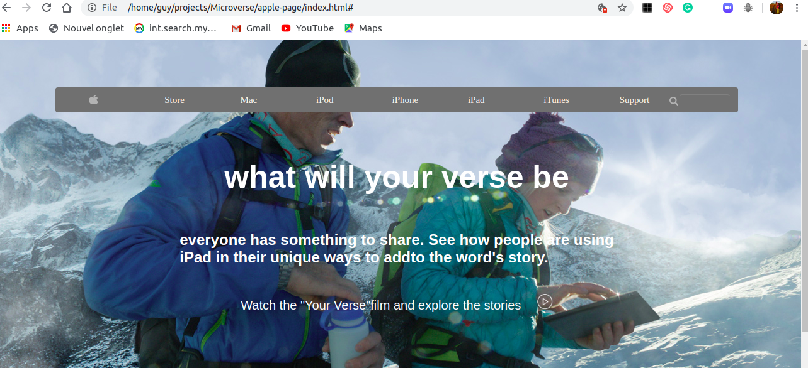
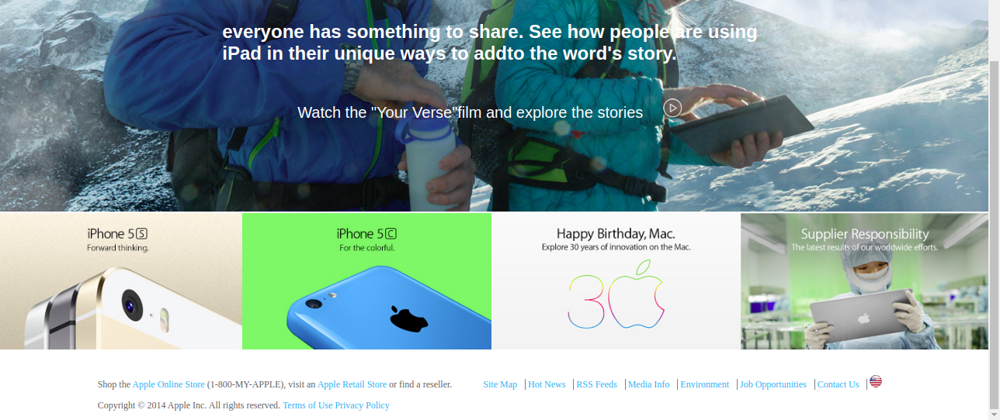

# apple-page
Building apple webpage projects with Backgrounds and Gradients

This is a clone application of Apple.com
 
 
 
 
 

## Built with
  * HTML 
  * CSS (Box Model, Float, Grid, Flex and Positioning)
  * Lint (Stickler)
  * Nu Html Checker
 

## Live demo
https://github.com/Guy-Gustave/apple-page/tree/feature-branch

## Getting started
**For this project, I tried with all my best to recreate the apple web page. The main aim is to ensure the elements get placed and styled and  it uses background photos well and the navbar at the top contains a gradient that you should be able to mimic..**

I used the browser’s developer tools to inspect the real apple  webpage to understand how elements are placed and styled.
I built our own page in a .html text file and opened it in  browser to check it out. I carried out the following steps:
  - First setup a github repository for the project.
  - Then create a .html file where all our HTML markup will go
  - Create a .css file where all styling code will reside
  - Then open the Apple webpage on https://web.archive.org/web/20140301004610/http://www.apple.com/ inspect its features with my browser's developer tools.

## Authors
 :bust_in_silhouette: **Author 1**
 * Github: https://github.com/Guy-Gustave
 * LinkedIn: https://www.linkedin.com/in/guy-gustave-nigaba/
 

## Contributing
Contributions, issues and feature requests are welcome!

   1. Fork the Project
   2. Create your Feature Branch (git checkout -b feature/AmazingFeature)
   3. Commit your Changes (git commit -m 'Add some AmazingFeature')
   4. Push to the Branch (git push origin feature/AmazingFeature)
   5. Open a Pull Request

## Show your support
Give a :star: if you like this project!

## Acknowledgements
  * [Microverse](https://www.microverse.org/)
  * [The Odin Project](https://www.theodinproject.com/courses/html5-and-css3/lessons/best-practices)
